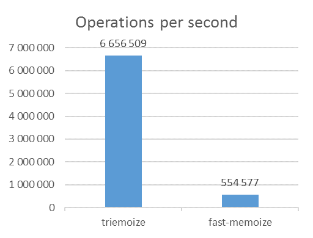

# Triemoize

Efficient, reliable and memory leak free memoization using WeakMaps and tries

[](https://travis-ci.org/ErikCupal/triemoize/)
[](https://www.npmjs.com/package/redux)
[](https://opensource.org/licenses/MIT)

There are many memoization libraries out there. What this library tries to achieve is to be

* Efficient
* Reliable
* Memory leak free

For all this to work, you must always use **immutable data** as function arguments when you're calling the memoized function.

Installation

```
npm install --save triemoize
```

If you're using Yarn


```
yarn add triemoize
```

## Usage

```js
import memoize from 'triemoize'

// Create a pure function
const add = (a, b) = a + b

// Memoize it
const memoizedAdd = memoize(add)

memoizedAdd(1, 2) // The function was called
memoizedAdd(1, 2) // This time the result was taken from cache
```

Unlike from other memoization techniques like serialization, you can safely use huge objects or arrays as function arguments without worrying about performance or memory leaks. However, all the arguments you pass in must be immutable. Otherwise the memoization would not work correctly.

```js
const getStringsLessThan = memoize((arrayOfStrings, num) => {
  return arrayOfStrings.filter(item => item.length < num)
})

const food = [
  'milk', 'bread', 'cheese', 'chocolate', 'potatoes', 'bacon',
  'butter', 'eggs', 'sausages', 'pork', 'yoghurt', 'apple'
]

getStringsLessThan(food, 6) // The function was called
getStringsLessThan(food, 6) // The result was taken from cache
```

## What you should be aware of

### Immutability

TODO

### Function taking zero arguments

There is no need to memoize a function that takes zero arguments as it always returns the same result (provided it's pure). Therefore I decided not to support memoizing such functions.

Instead of this

```js
const getHelloWorldString = memoize(() => 'hello world')

console.log(getHelloWorldString()) // undefined, not supported
```

simply do this :)

```js
const helloWorldString = 'hello world'

console.log(helloWorldString) // hello world
```

### Named arguments

Named arguments (using ES6 destructuring) are not supported. It would decrease performance, therefore I decided not to add this feature.

```js
// Not supported in the moment

const add = ({ a, b }) = a + b
const memoizedAdd = memoize(add)

memoizedAdd({ a: 1, b: 2 }) // The function was called
memoizedAdd({ a: 1, b: 2 }) // Fail, the value was recomputed
```

## How it works

TODO

## Benchmarks

I created a set of benchmarks that tests the performance of triemoize on four different functions. For comparision I have tested the performance of fast-memoize as well.

You can try the benchmarks yourself
    
clone the repo

    git clone https://github.com/ErikCupal/triemoize.git
    
install dependencies

    npm install
    
run benchmarks

    npm run benchmark

**Tested enviroment**: Node v8.2.1, Windows 64bit, Intel Core i7-6820HQ 2.70 GHz, 16 GB RAM

### Fibonacci

**Function:** ```const fibonacci = n => n < 2 ? n : fibonacci(n - 1) + fibonacci(n - 2)```

**Arguments:** `15`

**Results:**

| METHOD       | OPS/S      |
|--------------|------------|
| triemoize    | 32,781,123 |
| fast-memoize | 29,941,976 |


### Add

**Function:** ```const add = (a, b) => a + b```

**Arguments:** `1, 2`

**Results:**

| METHOD       | OPS/S      |
|--------------|------------|
| triemoize    | 19,939,274 |
| fast-memoize |    803,437 |


### Identity

**Function:** ```const identity = a => a```

**Preparation code:** ```const obj = {}```

**Arguments:** `obj`

**Results:**

| METHOD       | OPS/S      |
|--------------|------------|
| triemoize    |  7,721,084 |
| fast-memoize |    998,115 |


### Get strings shorter than

**Function:** ```const getStringsShorterThan = (array, n) => array.filter(item => item.length <= n)```

**Preparation code:** ```const food = ['milk', 'bread', 'wine', 'chocolate']```

**Arguments:** `food`

**Results:**

| METHOD       | OPS/S      |
|--------------|------------|
| triemoize    |  6,656,509 |
| fast-memoize |    554,577 |



## License

MIT
